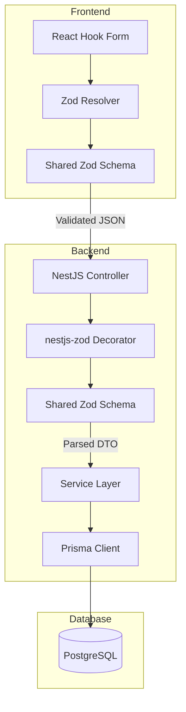

# Zod Validation Architecture Plan

## Overview

This plan outlines the implementation of shared Zod schemas for full-stack type safety across the frontend and backend of the Jira Lab application. The goal is to add runtime validation without breaking existing functionality.

## Current State Analysis

### Frontend (React + Vite)
- **Forms**: Plain React state with basic HTML5 validation
- **Types**: TypeScript types in [`src/features/auth/types.ts`](src/features/auth/types.ts) and [`src/features/jira/domain/types.ts`](src/features/jira/domain/types.ts)
- **API Client**: [`src/features/jira/api/jira.client.ts`](src/features/jira/api/jira.client.ts) with manual JSON serialization

### Backend (NestJS + Prisma)
- **Controllers**: Inline type definitions in controller decorators
- **Validation**: No validation layer - direct Prisma calls
- **Database**: Prisma schema in [`server/prisma/schema.prisma`](server/prisma/schema.prisma)

### Key Entities Requiring Validation

| Entity | Frontend Form | Backend Endpoint | Validation Rules |
|--------|---------------|------------------|------------------|
| LoginInput | LoginPage | POST /auth/login | email format, password min length |
| RegisterInput | RegisterPage | POST /auth/register | email format, name required, password min 6 chars |
| CreateBoardInput | BoardsPage | POST /boards | name required, min 1 char, max 100 chars |
| CreateSprintInput | BoardPage | POST /boards/:id/sprints | name required, isActive boolean |
| SetActiveSprintInput | BoardPage | PATCH /boards/:id/active-sprint | sprintId required |
| CreateIssueInput | IssueSidePanel | POST /issues | title required, status enum, boardId required |
| PatchIssueInput | IssueSidePanel | PATCH /issues/:id | partial Issue with valid fields |
| BatchPatchInput | BoardPage | PATCH /issues/batch | array of patch operations |

---

## Architecture Design

### Directory Structure

```
shared/
├── package.json
├── tsconfig.json
├── src/
│   ├── index.ts              # Main exports
│   ├── auth/
│   │   └── schemas.ts        # LoginInput, RegisterInput schemas
│   ├── boards/
│   │   └── schemas.ts        # Board schemas
│   ├── sprints/
│   │   └── schemas.ts        # Sprint schemas
│   ├── issues/
│   │   └── schemas.ts        # Issue schemas
│   └── utils/
│       └── common.ts         # Shared refinements, error messages
└── tests/
    ├── auth.schemas.test.ts
    ├── boards.schemas.test.ts
    ├── sprints.schemas.test.ts
    └── issues.schemas.test.ts
```

### Package Configuration

**shared/package.json**
```json
{
  "name": "@jira-lab/shared",
  "version": "1.0.0",
  "type": "module",
  "main": "./dist/index.js",
  "types": "./dist/index.d.ts",
  "exports": {
    ".": {
      "import": "./dist/index.js",
      "types": "./dist/index.d.ts"
    }
  },
  "scripts": {
    "build": "tsc",
    "test": "vitest run"
  },
  "peerDependencies": {
    "zod": "^3.23.0"
  },
  "devDependencies": {
    "typescript": "^5.9.3",
    "vitest": "^4.0.18",
    "zod": "^3.23.0"
  }
}
```

---

## Schema Definitions

### 1. Auth Schemas

```typescript
// shared/src/auth/schemas.ts
import { z } from 'zod';

export const LoginInputSchema = z.object({
  email: z
    .string()
    .min(1, 'Email is required')
    .email('Invalid email format')
    .transform(email => email.trim().toLowerCase()),
  password: z
    .string()
    .min(1, 'Password is required'),
});

export const RegisterInputSchema = z.object({
  email: z
    .string()
    .min(1, 'Email is required')
    .email('Invalid email format')
    .transform(email => email.trim().toLowerCase()),
  name: z
    .string()
    .min(1, 'Name is required')
    .max(100, 'Name must be at most 100 characters')
    .transform(name => name.trim()),
  password: z
    .string()
    .min(6, 'Password must be at least 6 characters')
    .max(100, 'Password must be at most 100 characters'),
});

export const AuthUserSchema = z.object({
  id: z.string(),
  email: z.string().email(),
  name: z.string(),
});

export const AuthResponseSchema = z.object({
  token: z.string(),
  user: AuthUserSchema,
});

// Type exports for TypeScript
export type LoginInput = z.infer<typeof LoginInputSchema>;
export type RegisterInput = z.infer<typeof RegisterInputSchema>;
export type AuthUser = z.infer<typeof AuthUserSchema>;
export type AuthResponse = z.infer<typeof AuthResponseSchema>;
```

### 2. Board Schemas

```typescript
// shared/src/boards/schemas.ts
import { z } from 'zod';

export const BoardSchema = z.object({
  id: z.string(),
  name: z.string().min(1).max(100),
});

export const CreateBoardInputSchema = z.object({
  name: z
    .string()
    .min(1, 'Board name is required')
    .max(100, 'Board name must be at most 100 characters')
    .transform(name => name.trim()),
});

export type Board = z.infer<typeof BoardSchema>;
export type CreateBoardInput = z.infer<typeof CreateBoardInputSchema>;
```

### 3. Sprint Schemas

```typescript
// shared/src/sprints/schemas.ts
import { z } from 'zod';

export const SprintSchema = z.object({
  id: z.string(),
  boardId: z.string(),
  name: z.string().min(1).max(100),
  isActive: z.boolean(),
});

export const CreateSprintInputSchema = z.object({
  name: z
    .string()
    .min(1, 'Sprint name is required')
    .max(100, 'Sprint name must be at most 100 characters')
    .transform(name => name.trim()),
  isActive: z.boolean().optional().default(false),
});

export const SetActiveSprintInputSchema = z.object({
  sprintId: z.string().min(1, 'Sprint ID is required'),
});

export type Sprint = z.infer<typeof SprintSchema>;
export type CreateSprintInput = z.infer<typeof CreateSprintInputSchema>;
export type SetActiveSprintInput = z.infer<typeof SetActiveSprintInputSchema>;
```

### 4. Issue Schemas

```typescript
// shared/src/issues/schemas.ts
import { z } from 'zod';

export const IssueStatusSchema = z.enum([
  'backlog',
  'todo', 
  'in_progress',
  'done',
]);

export const IssueSchema = z.object({
  id: z.string(),
  key: z.string(),
  boardId: z.string(),
  sprintId: z.string().nullable(),
  status: IssueStatusSchema,
  order: z.number().int().nonnegative(),
  title: z.string().min(1).max(500),
  description: z.string().max(10000),
  assigneeId: z.string().nullable(),
  watcherIds: z.array(z.string()),
});

export const CreateIssueInputSchema = z.object({
  boardId: z.string().min(1, 'Board ID is required'),
  sprintId: z.string().nullable().optional(),
  status: IssueStatusSchema.default('backlog'),
  order: z.number().int().nonnegative().default(0),
  title: z
    .string()
    .min(1, 'Title is required')
    .max(500, 'Title must be at most 500 characters')
    .transform(title => title.trim()),
  description: z.string().max(10000).default(''),
  assigneeId: z.string().nullable().optional(),
  watcherIds: z.array(z.string()).optional().default([]),
});

export const PatchIssueInputSchema = z.object({
  id: z.string().min(1),
  patch: z.object({
    title: z.string().min(1).max(500).optional(),
    description: z.string().max(10000).optional(),
    status: IssueStatusSchema.optional(),
    order: z.number().int().nonnegative().optional(),
    sprintId: z.string().nullable().optional(),
    assigneeId: z.string().nullable().optional(),
    watcherIds: z.array(z.string()).optional(),
  }).refine(
    patch => Object.keys(patch).length > 0,
    { message: 'Patch must contain at least one field' }
  ),
});

export const BatchPatchInputSchema = z.array(PatchIssueInputSchema)
  .min(1, 'Batch must contain at least one patch')
  .max(100, 'Batch cannot exceed 100 patches');

// Type exports
export type IssueStatus = z.infer<typeof IssueStatusSchema>;
export type Issue = z.infer<typeof IssueSchema>;
export type CreateIssueInput = z.infer<typeof CreateIssueInputSchema>;
export type PatchIssueInput = z.infer<typeof PatchIssueInputSchema>;
export type BatchPatchInput = z.infer<typeof BatchPatchInputSchema>;
```

---

## Backend Integration (NestJS + nestjs-zod)

### Installation

```bash
cd server
npm install zod nestjs-zod
```

### Module Configuration

```typescript
// server/src/app.module.ts
import { ZodModule } from 'nestjs-zod';

@Module({
  imports: [
    ZodModule.forRoot({
      validateInput: true,
      validateOutput: true,
    }),
    // ... other modules
  ],
})
export class AppModule {}
```

### Controller Updates

**Before (issues.controller.ts)**
```typescript
@Post()
create(
  @Req() req: any,
  @Body() body: {
    boardId: string;
    sprintId: string | null;
    title: string;
    // ... inline types
  },
) {
  return this.service.create(body, req.user.id);
}
```

**After (issues.controller.ts)**
```typescript
import { ZodBody } from 'nestjs-zod';
import { CreateIssueInputSchema } from '@jira-lab/shared';

@Post()
create(
  @Req() req: any,
  @ZodBody(CreateIssueInputSchema) body: CreateIssueInput,
) {
  return this.service.create(body, req.user.id);
}
```

### Error Handling

The `nestjs-zod` package automatically transforms Zod validation errors into proper HTTP exceptions:

```typescript
// Automatic error response format:
{
  "statusCode": 400,
  "message": "Validation failed",
  "errors": [
    {
      "path": ["email"],
      "message": "Invalid email format"
    }
  ]
}
```

---

## Frontend Integration (React Hook Form + Zod)

### Installation

```bash
npm install zod react-hook-form @hookform/resolvers
```

### Form Component Pattern

**Before (LoginPage.tsx)**
```typescript
const [email, setEmail] = useState("");
const [password, setPassword] = useState("");
const canSubmit = email.trim() && password && !loading;
```

**After (LoginPage.tsx)**
```typescript
import { useForm } from 'react-hook-form';
import { zodResolver } from '@hookform/resolvers/zod';
import { LoginInputSchema, type LoginInput } from '@jira-lab/shared';

const { register, handleSubmit, formState: { errors, isValid, isSubmitting } } = useForm<LoginInput>({
  resolver: zodResolver(LoginInputSchema),
  mode: 'onChange',
});

const onSubmit = async (data: LoginInput) => {
  // data is already validated and transformed
  const { token, user } = await authClient.login(data);
};
```

### Form UI Pattern

```tsx
<form onSubmit={handleSubmit(onSubmit)}>
  <input
    {...register('email')}
    type="email"
    aria-invalid={!!errors.email}
  />
  {errors.email && (
    <span className="error">{errors.email.message}</span>
  )}
  
  <button type="submit" disabled={!isValid || isSubmitting}>
    Sign in
  </button>
</form>
```

---

## Migration Strategy

### Phase 1: Shared Package Setup
1. Create `shared/` directory structure
2. Define all Zod schemas
3. Configure TypeScript and build process
4. Add unit tests for schemas

### Phase 2: Backend Integration
1. Install `zod` and `nestjs-zod` in server
2. Configure `ZodModule` in `app.module.ts`
3. Update controllers one by one:
   - AuthController (login, register)
   - BoardsController (create, sprints)
   - IssuesController (create, patch, batch)
4. Remove inline type definitions

### Phase 3: Frontend Integration
1. Install `react-hook-form` and `@hookform/resolvers`
2. Update forms one by one:
   - LoginPage
   - RegisterPage
   - IssueSidePanel (draft mode)
   - BoardsPage (create board)
3. Remove manual state management where appropriate

### Phase 4: Cleanup & Testing
1. Remove duplicate type definitions
2. Update imports across codebase
3. Add integration tests
4. Update documentation

---

## Testing Strategy

### Unit Tests for Schemas

```typescript
// shared/tests/auth.schemas.test.ts
import { describe, it, expect } from 'vitest';
import { LoginInputSchema, RegisterInputSchema } from '../src/auth/schemas';

describe('LoginInputSchema', () => {
  it('accepts valid input', () => {
    const result = LoginInputSchema.safeParse({
      email: 'test@example.com',
      password: 'password123',
    });
    expect(result.success).toBe(true);
  });

  it('rejects invalid email', () => {
    const result = LoginInputSchema.safeParse({
      email: 'not-an-email',
      password: 'password123',
    });
    expect(result.success).toBe(false);
  });

  it('trims and lowercases email', () => {
    const result = LoginInputSchema.parse({
      email: '  TEST@EXAMPLE.COM  ',
      password: 'password123',
    });
    expect(result.email).toBe('test@example.com');
  });
});
```

### Integration Tests for API

```typescript
// server/test/issues.controller.test.ts
describe('POST /issues', () => {
  it('rejects invalid input with 400', async () => {
    const response = await request(app)
      .post('/issues')
      .send({ title: '' }); // empty title
    expect(response.status).toBe(400);
    expect(response.body.errors).toContainEqual({
      path: ['title'],
      message: 'Title is required',
    });
  });
});
```

---

## Performance Considerations

1. **Schema Compilation**: Zod schemas are compiled once on first use, then cached
2. **Bundle Size**: Zod is ~12KB gzipped; shared package tree-shakeable
3. **Validation Timing**: 
   - Frontend: `mode: 'onChange'` for immediate feedback
   - Backend: Request body validated before controller execution
4. **Transformation**: Use `.transform()` sparingly to avoid double parsing

---

## Error Message Strategy

All error messages are user-friendly and can be displayed directly in the UI:

| Field | Error Condition | Message |
|-------|-----------------|---------|
| email | empty | "Email is required" |
| email | invalid format | "Invalid email format" |
| password | too short | "Password must be at least 6 characters" |
| title | empty | "Title is required" |
| title | too long | "Title must be at most 500 characters" |
| name | empty | "Name is required" |

---

## Mermaid Diagram: Data Flow



---

## Checklist for Implementation

- [ ] Create `shared/` package with Zod dependency
- [ ] Define all schemas with comprehensive validation rules
- [ ] Add unit tests for all schemas
- [ ] Configure workspace references in root `package.json`
- [ ] Install `nestjs-zod` in server package
- [ ] Update `app.module.ts` with ZodModule
- [ ] Migrate AuthController to use Zod decorators
- [ ] Migrate BoardsController to use Zod decorators
- [ ] Migrate IssuesController to use Zod decorators
- [ ] Install `react-hook-form` and `@hookform/resolvers` in frontend
- [ ] Migrate LoginPage to use react-hook-form
- [ ] Migrate RegisterPage to use react-hook-form
- [ ] Migrate IssueSidePanel to use Zod validation
- [ ] Remove duplicate type definitions
- [ ] Update all imports to use shared package
- [ ] Add integration tests for API validation
- [ ] Update documentation
